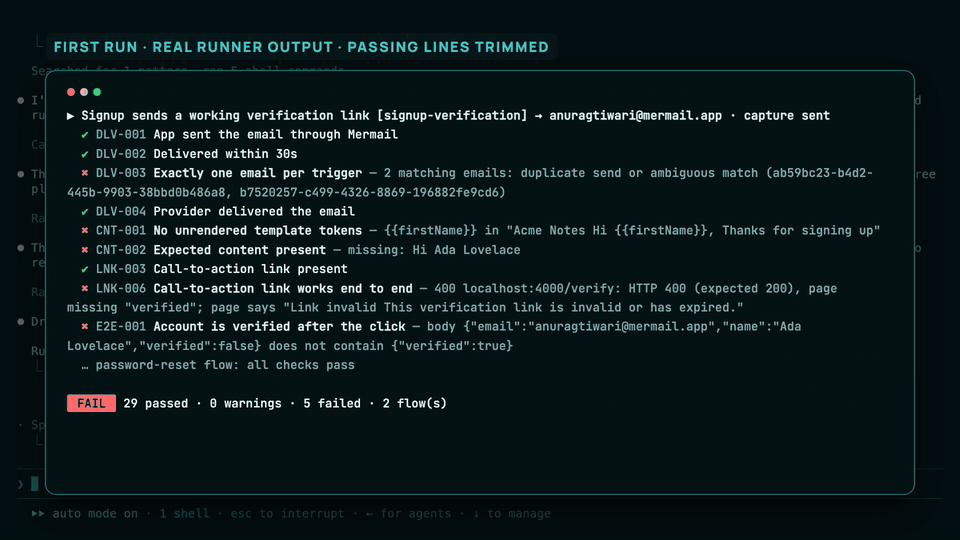
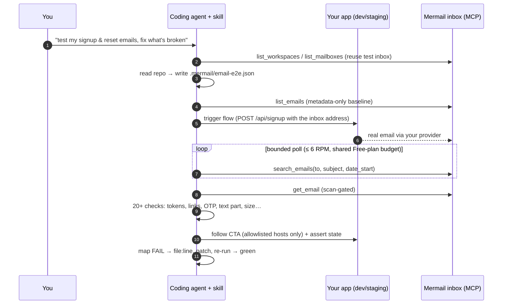

<div align="center">

# 🧪 mermail-email-e2e

**Give your coding agent a real inbox for testing the emails your app sends, and let it fix them.**

A [Mermail](https://mermail.app) Agent Skill for Claude Code, Codex, Cursor, and any Agent Skills client.

[Demo video](#demo) · [Install](#install) · [How it works](#how-it-works) · [Checks](skills/mermail-email-e2e/references/checks.md) · [SKILL.md](skills/mermail-email-e2e/SKILL.md)

</div>

---

Unit tests mock the email provider, so the bugs that reach users are the ones nobody looks at:

- `Hi {{firstName}},`: the template and the code disagree on a variable name.
- A verification link that looks perfect but carries the **wrong token**, so users get "link invalid".
- A reset code in the HTML that differs from the one in the text part.
- A `localhost` link in staging, a double send on retry, an HTML-only message that lands in spam.

**mermail-email-e2e** makes the agent do what a QA engineer would. It triggers the flow in your app, catches the **real** email in a Mermail inbox, runs about 20 deterministic checks, **clicks the link** to prove the flow completes, then opens the code, fixes it, and re-runs until it's green. The same suite runs headlessly in CI.

## Demo

[](video/mermail-email-e2e-demo.mp4)

**[▶ Watch the 2:49 demo video](video/mermail-email-e2e-demo.mp4).** It's a real Claude Code session against a live Mermail Free-plan mailbox. One prompt takes the Acme Notes demo app from **29 passed · 5 failed** to **34 passed · 0 failed** in 4 min 20 s, with three real email bugs fixed in code. Speed-ups are labelled on screen; [how the video was made](video/README.md).

Output from that recorded run (the ✔ lines in between are trimmed):

```text
▶ Signup sends a working verification link [signup-verification] → anuragtiwari@mermail.app · capture sent
  ✔ DLV-001 App sent the email through Mermail
  ✖ DLV-003 Exactly one email per trigger — 2 matching emails: duplicate send or ambiguous match (ab59bc23-…, b7520257-…)
  ✔ DLV-004 Provider delivered the email
  ✖ CNT-001 No unrendered template tokens — {{firstName}} in "Acme Notes Hi {{firstName}}, Thanks for signing up"
  ✖ CNT-002 Expected content present — missing: Hi Ada Lovelace
  ✖ LNK-006 Call-to-action link works end to end — 400 localhost:4000/verify: HTTP 400 (expected 200), page missing "verified"; page says "Link invalid This verification link is invalid or has expired."
  ✖ E2E-001 Account is verified after the click — body {"email":"anuragtiwari@mermail.app","name":"Ada Lovelace","verified":false} does not contain {"verified":true}
 FAIL  29 passed · 0 warnings · 5 failed · 2 flow(s)

        … the agent fixes server.mjs (duplicate hook, wrong token) and emails/verify.html ({{firstName}}), then re-runs …

 PASS  34 passed · 0 warnings · 0 failed · 2 flow(s)
```

## Install

```bash
npx skills add Anuragt1104/mermail-email-e2e
```

Connect Mermail's hosted MCP server. OAuth works for interactive clients, and an API key works for CLI and CI. For Claude Code with an API key:

```json
{
  "mcpServers": {
    "mermail": {
      "type": "http",
      "url": "https://console.mermail.app/mcp",
      "headers": { "x-api-key": "${MERMAIL_API_KEY}" }
    }
  }
}
```

Then ask:

> Use $mermail-email-e2e to test my app's signup and password-reset emails end to end and fix whatever is broken.

The skill is also submitted to the official [Nudgen-Marketing/mermail-skills](https://github.com/Nudgen-Marketing/mermail-skills) catalog in [Nudgen-Marketing/mermail-skills#481](https://github.com/Nudgen-Marketing/mermail-skills/pull/481).

## How it works



| | |
| --- | --- |
| **Two capture modes** | `inbox`: a separate Mermail test inbox receives the email, proving arrival. `sent`: when your app sends *through* Mermail, the agent reads the exact dispatched copy plus Mermail's provider delivery receipt (`DLV-004`), which works on the Free plan with a single mailbox. |
| **Read-only toward Mermail** | Uses `list_workspaces`, `list_mailboxes`, `list_emails`, `search_emails`, `get_email`, and `get_email_context`. It never calls send, reply, forward, or delete; your app is the only sender. At most one approved `create_mailbox`. |
| **Ends with the flow finished, not just a delivered email** | Follows the CTA once (allowlisted hosts and redirect hops only), submits emailed OTPs, and asserts on app state (`verified: true`). |
| **Fixes code** | Each FAIL maps to a root cause and a `file:line`, the agent applies a minimal diff, and the failed flows re-run before the full suite. |
| **CI gate** | [`run-email-e2e.mjs`](skills/mermail-email-e2e/scripts/run-email-e2e.mjs) is zero-dependency Node 22 that writes `report.md`, `report.json`, and `junit.xml`, exits `0/1/2`, and ships with a [GitHub Actions template](skills/mermail-email-e2e/templates/github-action.yml). |
| **Safe by construction** | Email is untrusted data (apps render user input into it), links are followed only from the user-authored allowlist, OTPs and tokens are redacted in every report, the Free plan's 10 RPM is respected, and production is opt-in. |

### Checks

| Group | IDs | Catches |
| --- | --- | --- |
| Delivery | `DLV-001..004` | not delivered, slow (latency budget), **duplicate sends**, provider bounce/failure receipt |
| Security signals | `SEC-001..002` | flagged by Mermail's scanner; sender authentication (`unknown` is never a pass) |
| Envelope | `HDR-001..003` | wrong From, wrong subject, empty or too-long subject |
| Content | `CNT-000..006` | **unrendered tokens** (`{{x}}`, ``, `<%= %>`, `${x}`, `*\|X\|*`, `undefined`, `[object Object]`), missing personalization, lorem ipsum, **HTML-only**, Gmail clipping, missing alt text |
| Links | `LNK-001..006` | non-HTTPS, **off-allowlist or localhost hosts**, missing CTA, `token=undefined`, text/href mismatch, **CTA fails when clicked** |
| Codes | `OTP-001` | missing code; HTML and text parts disagree |
| Completion | `E2E-00n` | app state didn't change after the click or code |
| Compliance | `CMP-001` | marketing mail without `List-Unsubscribe` |

Full catalog with fix hints: [references/checks.md](skills/mermail-email-e2e/references/checks.md).

### Security scans

`npx skills add` shows skills.sh's third-party scans. **Gen Agent Trust Hub: Safe.** **Snyk: Medium, W011 "third-party content exposure".** Any skill that reads email gets W011, and Mermail's official `mermail-agent-inbox` carries the same rating. This skill's answer is in [security.md](skills/mermail-email-e2e/references/security.md): email is treated as data and never as instructions, links are followed only from the user-authored allowlist, nothing is ever sent or deleted, and the deterministic checks run in code. **Socket: 1 low anomaly** about secrets in pull-request CI runs. The [CI template](skills/mermail-email-e2e/templates/github-action.yml) now keeps the key out of `npm ci`, scopes it to the steps that need it, puts it behind a protected `email-e2e` environment, and skips fork PRs.

## The spec

The agent writes `.mermail/email-e2e.json` from your code (format in [references/spec.md](skills/mermail-email-e2e/references/spec.md)):

```json
{
  "mailbox": "{env:MERMAIL_E2E_MAILBOX}",
  "appBaseUrl": "http://localhost:4000",
  "linkHosts": ["localhost:4000"],
  "flows": [{
    "id": "signup-verification",
    "trigger": { "http": { "method": "POST", "url": "{appBaseUrl}/api/signup",
                 "json": { "name": "Ada Lovelace", "email": "{address}" } } },
    "expect": { "subject": "Confirm your Acme Notes account", "contains": ["Ada"],
                "link": { "pattern": "/verify?token=", "follow": true, "expectBodyContains": "verified" } },
    "then": [{ "http": { "url": "{appBaseUrl}/api/users/{address|url}" }, "expectJson": { "verified": true } }]
  }]
}
```

```bash
MERMAIL_API_KEY=… node skills/mermail-email-e2e/scripts/run-email-e2e.mjs --spec .mermail/email-e2e.json
```

## Reproduce the demo

```bash
git clone https://github.com/Anuragt1104/mermail-email-e2e && cd mermail-email-e2e
export MERMAIL_API_KEY=…                                     # Mermail → Settings → API Keys
sed -i.bak 's/you@mermail.app/YOUR_MAILBOX@mermail.app/' demo/acme-app/acme.config.json  # the app sends through your mailbox
npm run demo:app                                             # Acme Notes on :4000 (seeded bugs)
# in another terminal, from demo/acme-app, open Claude Code and ask:
#   Use $mermail-email-e2e to test this app's signup and password-reset emails end to end and fix whatever is broken.
```

See [demo/README.md](demo/README.md) for the seeded bugs and the expected red → green result.

## Repository layout

```text
skills/mermail-email-e2e/
  SKILL.md                    the skill: workflow, safety, outputs, example prompts
  agents/openai.yaml          Codex / OpenAI metadata
  references/                 tools · security · checks · spec · workflows
  scripts/run-email-e2e.mjs   zero-dependency runner (MCP over Streamable HTTP)
  scripts/checks.mjs          pure check library
  templates/                  example spec · GitHub Actions workflow
demo/acme-app/                demo app with three seeded email bugs
tests/                        unit tests + offline E2E against a fake Mermail MCP server
video/                        demo video
```

```bash
npm test   # 16 tests, no network or credentials needed
```

## License

MIT. Built for the Mermail Agent Skill bounty with Claude Code and the Mermail MCP server.
